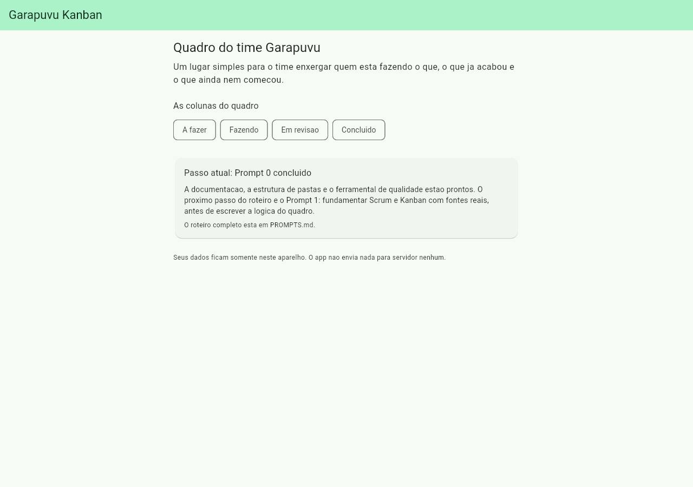
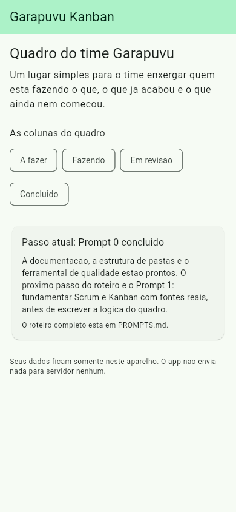

# Garapuvu Kanban

Aplicativo **Flutter** para o time do **projeto social Garapuvu** organizar suas
tarefas em um quadro **Scrum/Kanban**: cada tarefa é um card que caminha por
`A fazer → Fazendo → Em revisão → Concluído`, com prioridade, responsável e
sprint.

> **Privacidade:** os dados ficam **somente no aparelho** de quem usa. Não há
> conta, não há servidor, nada é enviado para lugar nenhum.

Este é um projeto **didático**: ele é construído passo a passo, um prompt de cada
vez, com testes, acessibilidade e documentação em cada etapa.

---

## Onde está cada coisa

| Arquivo | Para que serve |
| --- | --- |
| [`instrucoes-do-projeto-garapuvu-kanban.md`](instrucoes-do-projeto-garapuvu-kanban.md) | **A lei do projeto.** Stack, arquitetura, regras de negócio e as regras automáticas de toda resposta da IA. |
| [`PROMPTS.md`](PROMPTS.md) | **O roteiro e o diário.** Prompt 0 → 13, cada um com texto pronto para colar. Comece por aqui. |
| [`GLOSSARIO.md`](GLOSSARIO.md) | Todo termo novo explicado em uma frase, para leigos. |
| [`RESUMAO.md`](RESUMAO.md) | O que o projeto é hoje, em linguagem simples. |
| `.github/copilot-instructions.md` e `CLAUDE.md` | Fazem qualquer assistente de IA carregar as regras sozinho. |

---

## 1. Instalando o Flutter (macOS)

Se você já tem o Flutter, pule para o passo 2. Se `flutter --version` diz
"command not found", siga a
[instalação manual oficial](https://docs.flutter.dev/install/manual):

```bash
# 1. Ferramentas de linha de comando do Xcode
xcode-select --install

# 2. Baixe o bundle do SDK para o seu processador
#    Apple Silicon (M1/M2/M3/M4) -> bundle ARM64
#    Intel                       -> bundle x64
#    (Menu Apple  > Sobre este Mac mostra qual é o seu)
#    Página de download: https://docs.flutter.dev/install/manual

# 3. Descompacte em uma pasta sua (o exemplo usa ~/develop)
mkdir -p ~/develop
unzip ~/Downloads/flutter_macos_*-stable.zip -d ~/develop/

# 4. Coloque o Flutter no PATH (zsh é o shell padrão do macOS)
echo 'export PATH="$HOME/develop/flutter/bin:$PATH"' >> ~/.zprofile
source ~/.zprofile

# 5. Confirme
flutter --version
dart --version
flutter doctor
```

`flutter doctor` lista o que ainda falta (Android Studio, licenças do Android,
CocoaPods para iOS). Resolva os itens marcados com `✗` antes de rodar o app em
aparelho.

---

## 2. Preparando este projeto

O repositório já traz o código Dart, os testes, a documentação e o ferramental
de qualidade. Faltam apenas as pastas geradas pelo Flutter para cada plataforma
(`android/`, `ios/`, `web/`) — um script cuida disso **sem sobrescrever** nada:

```bash
cd app-flutter
make bootstrap     # cria android/ ios/ web/, roda pub get e ativa o hook
```

> Não rode `flutter create .` direto na pasta: ele sobrescreveria `pubspec.yaml`,
> `lib/main.dart` e `analysis_options.yaml`. O `make bootstrap` existe exatamente
> para evitar isso.

Se as pastas de plataforma já existirem, basta:

```bash
make prepare       # flutter pub get + ativa o hook de pre-commit
```

---

## 3. Rodando

```bash
flutter doctor     # check-up do ambiente (o que falta instalar)
flutter devices    # veja onde o app pode abrir agora
make run           # roda o app
```

Para rodar no navegador: `flutter run -d chrome`.

Para servir num endereço local sem abrir janela nenhuma (bom para conferir o app
e tirar print):

```bash
flutter run -d web-server --web-port=8080
# depois abra http://127.0.0.1:8080
```

> **Só na primeira vez:** se as pastas `android/`, `ios/` e `web/` ainda não
> existirem, rode `make bootstrap` antes. Sem elas o Flutter não sabe montar o
> app para nenhuma plataforma.

Com o app aberto, `r` recarrega a mudança na hora (*hot reload*), `R` reinicia do
zero e `q` encerra.

### Como a tela inicial está hoje

| Computador / tablet | Celular |
| --- | --- |
|  |  |

---

## 4. Qualidade de código

O equivalente Flutter do trio ESLint + Prettier + Husky do template web:

| Comando | O que faz | Equivale a |
| --- | --- | --- |
| `make format` | `dart format .` | Prettier `--write` |
| `make lint` | `flutter analyze` | ESLint |
| `make test` | `flutter test` | testes unitários + de tela |
| `make e2e` | `flutter test integration_test` | Playwright |
| `make check` | os três primeiros juntos, em modo verificação | `npm run check` |
| `make prepare` | dependências + ativa o hook | `npm install` + Husky |

**O hook de pre-commit** (`.githooks/pre-commit`) roda `format → analyze → test`
antes de **cada** commit, em **qualquer** branch. Código fora do padrão, com
aviso do analisador ou com teste vermelho **não entra no histórico**.

Ative-o uma vez com `make prepare` (ou `git config core.hooksPath .githooks`).

---

## 5. Gerando o app (build)

**Buildar** é transformar o código em um arquivo que o aparelho sabe abrir. Tudo
o que é gerado cai na pasta `build/`, que o `.gitignore` já ignora — arquivo
compilado **não** entra no histórico do Git.

| Comando | O que faz | O que sai |
| --- | --- | --- |
| `make build-local` | compila em **debug**, só para conferir que o app compila nesta máquina | conforme a `PLATAFORMA` |
| `make build-android` | versão **Android** em release | `.apk` + `.aab` |
| `make build-ios` | versão **iOS** em release, **sem** assinatura | `Runner.app` |
| `make build-ipa` | versão **iOS assinada**, para a App Store | `.ipa` |
| `make build-web` | site do app (bônus) | `build/web/` |
| `make build` | as três plataformas de uma vez | tudo acima |
| `make build-deploy` | **prepara o deploy**: `make check` → limpeza → AAB + IPA + web | pacote das lojas |
| `make artefatos` | mostra quais arquivos de build já existem | — |
| `make doctor` | check-up do ambiente (`flutter doctor`) | — |
| `make ajuda` | lista todos os comandos do `Makefile` | — |

Dois ajustes na hora de chamar:

```bash
make build-local PLATAFORMA=android        # web (padrão) | android | ios
make build-deploy VERSAO=0.2.0 NUMERO=8    # versão que a pessoa vê + número interno
```

Sem `VERSAO`/`NUMERO`, vale o que está no `pubspec.yaml` (`version: 0.1.0+1`).
O `NUMERO` precisa **crescer a cada envio** para a loja aceitar.

**debug × release**, em uma frase cada:

- **debug** compila rápido, mostra os erros na tela e aceita *hot reload* — é o
  modo de desenvolver.
- **release** compila otimizado e sem ferramenta de desenvolvedor — é o modo que
  vai para o celular de quem usa.

### O que cada plataforma exige antes

| Plataforma | Precisa de |
| --- | --- |
| Web | nada além do Flutter — por isso é o padrão do `make build-local` |
| Android | Android SDK com as licenças aceitas (`flutter doctor --android-licenses`); para a Play, a chave de assinatura em `android/key.properties` |
| iOS | macOS + Xcode; para a App Store, um *Team* configurado em Signing & Capabilities |

Se algo faltar, o comando **explica o que aconteceu e qual é o próximo passo** —
inclusive quando as pastas `android/`, `ios/` e `web/` ainda não existem (aí a
resposta é `make bootstrap`).

---

## 6. Subindo o repositório para o GitHub

```bash
# 1. Inicie o repositório (se ainda não iniciou)
git init -b main

# 2. Ative o hook ANTES do primeiro commit
make prepare

# 3. Confira que está tudo verde
make check

# 4. Primeiro commit
git add .
git commit -m "Prompt 0: instrucoes, roteiro, scaffold e ferramental"

# 5. Crie o repositório remoto e envie
#    (pelo site do GitHub, ou com o gh CLI:)
gh repo create garapuvu-kanban --private --source=. --remote=origin
git push -u origin main
```

Sem o `gh`, crie o repositório pelo site e depois:

```bash
git remote add origin git@github.com:SEU-USUARIO/garapuvu-kanban.git
git push -u origin main
```

---

## 7. Estrutura de pastas

```
lib/
  main.dart                     # ponto de entrada, e só
  app.dart                      # MaterialApp, tema, rotas
  src/
    core/theme/                 # design tokens e contraste
    core/utils/                 # helpers puros
    features/board/model/       # Tarefa, Status, Prioridade, Sprint (Dart puro)
    features/board/state/       # QuadroController (ChangeNotifier)
    features/board/view/        # telas
    features/board/widgets/     # componentes
    data/                       # shared_preferences <-> JSON
test/unit/                      # lógica pura
test/widget/                    # telas e componentes
integration_test/               # fluxo ponta a ponta
docs/screenshots/               # prints da "definição de pronto visual"
```

---

## 8. Próximo passo

Abra [`PROMPTS.md`](PROMPTS.md) e rode o **Prompt 1** — a fundamentação de Scrum
e Kanban com fontes reais. O texto já está pronto para colar.
